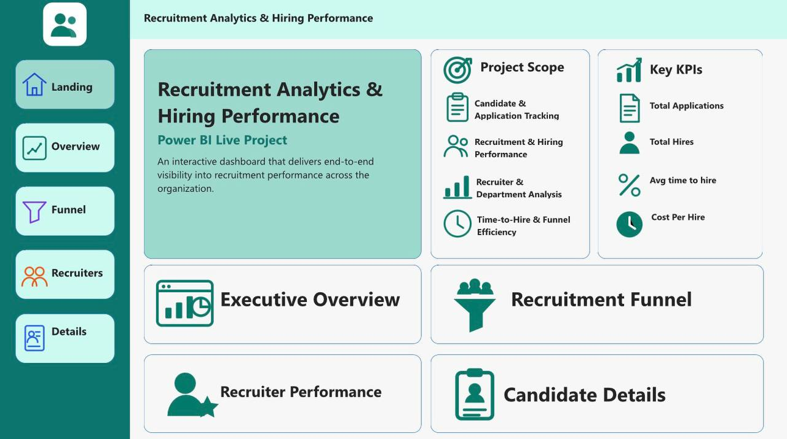

# Recruitment-Analytics-Hiring-Performance
Power Bi recruitment analytics dashboard analyzing hiring performance, recruitment funnel, recruiter performance, candidate source, cost, and time to hire.
Recruitment Analytics & Hiring Performance

<h1 align="center">Recruitment Analytics & Hiring Performance</h1>

Power BI Live Project

Recruitment Analytics & Hiring Performance is an interactive Power BI project designed to analyze the complete recruitment process from candidate application to final hire.

The dashboard helps HR teams monitor recruitment activity, hiring efficiency, recruiter performance, recruitment sources, candidate movement, costs, and hiring outcomes.

⸻

<h2>Project Overview</h2>

The project simulates a recruitment environment for a UAE-based organization operating across multiple departments and locations.

The original dataset contains 2,500 candidate records covering January 2024 to July 2026.

The project covers the complete Power BI workflow.

Power Query → Data Cleaning → Data Modelling → DAX → Dashboard Design → Power BI Service → GitHub

⸻

<h2>Business Problem</h2>

Management needs a clear view of recruitment performance.

The dashboard was developed to answer questions such as

* How many candidates apply for available positions
* How many candidates reach the interview stage
* How many offers are issued
* How many candidates are hired
* Where candidates leave the recruitment funnel
* Which departments generate the most hiring activity
* Which recruitment sources produce successful hires
* How recruiters compare against each other
* How long it takes to hire candidates
* How much recruitment costs
* Why candidates are rejected

⸻

<h2>Project Objectives</h2>

The main objectives are

* Track recruitment activity
* Monitor the recruitment funnel
* Measure hiring conversion
* Analyze recruitment costs
* Measure time to hire
* Compare recruiter performance
* Analyze department hiring activity
* Evaluate recruitment sources
* Track candidate status
* Analyze rejection reasons
* Provide detailed candidate-level information

⸻

<h2>Dataset</h2>

The recruitment dataset includes fields such as

Field	Description
Candidate ID	Unique candidate identifier
Candidate Name	Candidate full name
Gender	Candidate gender
Nationality	Candidate nationality
Application Date	Date application was received
Requisition ID	Job requisition identifier
Job Title	Position applied for
Department	Hiring department
Location	Work location
Recruitment Source	Candidate acquisition source
Recruiter	Recruiter responsible for candidate
Application Status	Recruitment stage
Interview Date	Candidate interview date
Offer Date	Job offer date
Hire Date	Candidate hire date
Salary Offered AED	Monthly salary offered
Recruitment Cost AED	Recruitment cost
Experience Years	Candidate experience
Candidate Rating	Candidate assessment score
Rejection Reason	Reason candidate was rejected
Employment Type	Employment category
Target Fill Date	Expected requisition completion date

⸻

<h2>Data Cleaning</h2>

Power Query was used to prepare the dataset before analysis.

The cleaning process included

* Removing duplicate Candidate IDs
* Trimming Candidate Name values
* Cleaning unnecessary spaces
* Standardizing Gender
* Standardizing Department names
* Standardizing Recruitment Source
* Standardizing Application Status
* Handling missing Recruiter values
* Handling missing Location values
* Identifying invalid salary values
* Identifying invalid recruitment costs
* Validating Experience Years
* Validating Candidate Rating
* Validating recruitment dates
* Correcting data types

Examples of standardized Department values include

* Human Resources
* Finance
* Information Technology
* Sales
* Marketing
* Operations
* Customer Service
* Procurement
* Administration

⸻

<h2>Data Quality Rules</h2>

Salary Offered AED

* Values below AED 1,000 were treated as invalid
* Values above AED 100,000 were treated as invalid
* Invalid values were replaced with null

Recruitment Cost AED

* Negative recruitment costs were replaced with null

Experience Years

* Valid range was set between 0 and 25 years

Candidate Rating

* Valid range was set between 1 and 5

Recruitment Dates

The expected recruitment sequence is

Application → Interview → Offer → Hire

Dates that violated the recruitment sequence were treated as invalid.

⸻

<h2>Data Model</h2>

A dedicated Date Table was created for time-based analysis.

Main relationship

Date Table[Date] → Recruitment_Data[Application Date]

Relationship type

One-to-Many

Cross-filter direction

Single

The Date Table contains

* Date
* Year
* Month
* Month Number
* Year Month
* Year Month Sort

⸻

<h2>Main DAX Measures</h2>

Total Applications

Total Applications =
DISTINCTCOUNT(Recruitment_Data[Candidate ID])

Total Hires

Total Hires =
CALCULATE(
    DISTINCTCOUNT(Recruitment_Data[Candidate ID]),
    NOT ISBLANK(Recruitment_Data[Hire Date])
)

Total Interviews

Total Interviews =
CALCULATE(
    DISTINCTCOUNT(Recruitment_Data[Candidate ID]),
    NOT ISBLANK(Recruitment_Data[Interview Date])
)

Total Offers

Total Offers =
CALCULATE(
    DISTINCTCOUNT(Recruitment_Data[Candidate ID]),
    NOT ISBLANK(Recruitment_Data[Offer Date])
)

Hiring Rate

Hiring Rate =
DIVIDE(
    [Total Hires],
    [Total Applications],
    0
)

Offer Acceptance Rate

Offer Acceptance Rate =
DIVIDE(
    [Total Hires],
    [Total Offers],
    0
)

Average Time to Hire

Average Time to Hire =
AVERAGEX(
    FILTER(
        Recruitment_Data,
        NOT ISBLANK(Recruitment_Data[Hire Date])
    ),
    DATEDIFF(
        Recruitment_Data[Application Date],
        Recruitment_Data[Hire Date],
        DAY
    )
)

Hiring Recruitment Cost

Hiring Recruitment Cost =
CALCULATE(
    SUM(Recruitment_Data[Recruitment Cost AED]),
    NOT ISBLANK(Recruitment_Data[Hire Date])
)

Cost Per Hire

Cost Per Hire =
DIVIDE(
    [Hiring Recruitment Cost],
    [Total Hires],
    0
)

Rejected Candidates

Rejected Candidates =
CALCULATE(
    DISTINCTCOUNT(Recruitment_Data[Candidate ID]),
    Recruitment_Data[Application Status] = "Rejected"
)

⸻

<h2>Recruitment Funnel</h2>

The recruitment funnel tracks candidate movement through four measurable stages.

Applications → Interviews → Offers → Hires

Current funnel values

Stage	Candidates
Applications	2,478
Interviews	1,592
Offers	534
Hires	407

Additional funnel metrics include

* Stage Conversion Rate
* Stage Drop-off Rate
* Candidates Lost
* Previous Stage Candidates

These measures make it possible to identify where candidate loss occurs during recruitment.

⸻

<h2>Dashboard Pages</h2>
<h3>Landing Page</h3>

The landing page provides project navigation and summary information.

Sections include

* Project Scope
* Key KPIs
* Executive Overview navigation
* Recruitment Funnel navigation
* Recruiter Performance navigation
* Candidate Details navigation

⸻

<h3>Executive Overview</h3>

The Executive Overview provides a management-level view of recruitment performance.

KPIs

* Total Applications
* Total Hires
* Hiring Rate
* Average Time to Hire
* Cost per Hire
* Offer Acceptance Rate

Visuals

* Applications by Month
* Hires by Department
* Applications by Recruitment Source
* Hires by Location
* Application Status

Filters

* Year
* Department
* Location
* Recruiter

⸻

<h3>Recruitment Funnel</h3>

The Recruitment Funnel page analyzes candidate movement through the hiring process.

KPIs

* Applications
* Interviews
* Offers
* Hires

Visuals

* Recruitment Funnel
* Rejection Reasons
* Stage Conversion by Department
* Source Effectiveness
* Funnel Stage Summary

The Funnel Stage Summary includes

* Candidates
* Conversion Rate
* Drop-off Rate
* Candidates Lost

⸻

<h3>Recruiter Performance</h3>

This page compares recruiter productivity and hiring outcomes.

KPIs

* Applications Handled
* Total Hires
* Hiring Rate
* Average Time to Hire

Visuals

* Recruiter Performance Matrix
* Hires by Recruiter
* Hiring Trend by Recruiter
* Top Recruiters
* Cost per Hire by Recruiter

The Recruiter Performance Matrix includes

* Applications
* Hires
* Hiring Rate
* Average Time to Hire
* Offer Acceptance Rate
* Cost per Hire

⸻

<h3>Candidate Details</h3>

This page provides candidate-level recruitment information.

KPIs

* Total Candidates
* Total Interviews
* Rejected Candidates

Candidate information includes

* Candidate ID
* Candidate Name
* Job Title
* Department
* Location
* Recruitment Source
* Recruiter
* Application Status
* Application Date
* Interview Date
* Offer Date
* Hire Date
* Salary Offered AED
* Experience Years
* Candidate Rating

Additional visuals

* Candidate Status Breakdown
* Rejection Reason Summary

⸻

<h2>Dashboard Interactivity</h2>

The report supports interactive analysis through

* Slicers
* Cross-filtering
* Page navigation
* Interactive charts
* Candidate-level filtering
* Department filtering
* Recruiter filtering
* Location filtering
* Recruitment status filtering
* Time-based filtering

Selecting a department, recruiter, recruitment source, status, or other category updates related visuals and KPI cards.

⸻

<h2>Key Insights</h2>

The current recruitment funnel contains

* 2,478 unique applications
* 1,592 candidates reaching interviews
* 534 candidates receiving offers
* 407 candidates being hired

The dashboard allows further investigation into

* Candidate drop-off points
* Department recruitment performance
* Recruitment source effectiveness
* Recruiter productivity
* Recruitment costs
* Hiring speed
* Candidate rejection reasons
* Geographic hiring activity

⸻

<h2>Tools Used</h2>

* Microsoft Power BI Desktop
* Power Query
* DAX
* Microsoft Excel
* Power BI Service
* GitHub

⸻

<h2>Project Files</h2>

Recommended repository structure

Recruitment-Analytics-Hiring-Performance
│
├── README.md
├── Recruitment_Analytics_Hiring_Performance.pbix
│
├── Data
│   └── Recruitment_Analytics_Live_Project.xlsx
│
├── Screenshots
│   ├── Landing_Page.png
│   ├── Executive_Overview.png
│   ├── Recruitment_Funnel.png
│   ├── Recruiter_Performance.png
│   └── Candidate_Details.png
│
└── Assets
    └── Recruitment_Analytics_Project_Logo.svg

⸻

<h2>Dashboard Screenshots</h2>

Landing Page

Executive Overview

Recruitment Funnel

Recruiter Performance

Candidate Details

⸻

<h2>Project Purpose</h2>

This project was created as a portfolio project to demonstrate practical skills in

* Power BI development
* HR Analytics
* Recruitment Analytics
* Power Query
* Data Cleaning
* Data Modelling
* DAX
* KPI development
* Dashboard design
* Business analysis
* Interactive reporting

⸻

<h2>Author</h2>

Mustafa Mohjoob

HR Officer | HR Analytics | Data Analyst | Power BI Developer

Portfolio

https://mustafa-power-bi-portfolio.mustafa-mohjoob.chatgpt.site/

LinkedIn

www.linkedin.com/in/mustafa-mahjoob

## Live Power BI Dashboard

[View Interactive Power BI Report]([https://app.powerbi.com/view?r=eyJrIjoiNTAzOTEyOTktNzUwNS00MWNlLTgwOGUtNTgxMGViNjM1NGExIiwidCI6IjBlYjRjMjE0LWI5NWQtNDM0Ny1hMTg5LTc1YjBlMGIzMGUzZiJ9&pageName=60bf7d6151472280ceb7])
